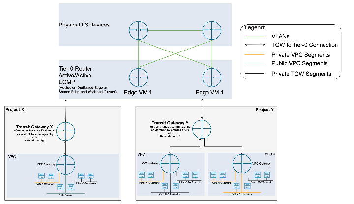

# Network Overview and Components
The networking foundation for this reference architecture is built on VMware vSphere Distributed Switch (VDS) and NSX-T Data Center, providing a software-defined, scalable, and secure network fabric. This architecture combines the flexibility of NSX-T overlay networks with the logical segmentation capabilities of Projects and Virtual Private Clouds (VPCs), introduced in VMware Cloud Foundation 9\.

## vSphere Distributed Switch (VDS)
VDS provides the base network virtualization layer for vSphere clusters. It handles management, vMotion, and storage network traffic, and integrates with NSX-T for overlay transport and workload connectivity.

## NSX-T Overlay Networking
NSX-T overlay networking abstracts physical network boundaries, enabling logical segmentation, distributed routing, and micro-segmentation. It supports east-west traffic optimization and simplifies network provisioning for Tanzu Platform components.

### Projects in NSX-T
Projects act as administrative and logical boundaries, allowing isolated environments for different tenants, workloads, or lifecycle stages. 

* Key Concepts:  
  * Enterprise Administrator (‘Enterprise Admin’) can create and configure custom Projects as needed.  
  * Resource Allocation: Projects can have quotas set for various resources, such as IP addresses, subnets, and security groups, to prevent overconsumption and ensure fair distribution.  
  * Isolation: Each project operates independently, ensuring that configurations and policies do not overlap or interfere with other projects.  
  * Role-Based Access Control (RBAC): Administrators can assign specific roles to users within a project, controlling their permissions and access to resources.  
  * Integration with NSX-T Components: Projects integrate seamlessly with other NSX-T components, including Virtual Private Clouds (VPCs), segments, and security policies, to provide a comprehensive network management solution.

For more details on Projects in NSX-T, refer to [official documentation](https://techdocs.broadcom.com/us/en/vmware-cis/vcf/vcf-9-0-and-later/9-0/advanced-network-management/administration-guide/nsx-multi-tenancy/nsx-projects.html).

### VPCs within Projects
Within each Project, VPCs provide self-contained, policy-driven network environments.  
Each VPC encapsulates logical segments, routing, gateway configurations, and associated policies, enabling consistent isolation and governance across environments.

* Key Concepts  
  * An NSX VPC is a logical, isolated network domain created within an NSX Project, enabling fine-grained tenancy boundaries and policy-based control by application, service, or business unit  
  * Each VPC maintains its own gateway, IP address blocks, routing configuration, security/nat policies, and resource quotas, ensuring workload and policy isolation as well as delegated management for specific teams  
  * VPCs leverage upstream provider constructs from their parent Project, such as Tier-0 Gateways and edge clusters, to provide scalable and secure north–south (external) connectivity  
  * Subnets within a VPC can use multiple access modes to meet varied needs: Private (internal to VPC), Public (routed externally), and Private-Transit-GW (internal shared Project routing)  
* High-Level VPC Workflow  
  * Project Admin creates an NSX VPC within a project, configuring basic settings such as IP assignment, DHCP, and edge cluster.  
  * Project Admin assign roles and quotas/limits for users in the VPC.  
  * VPC or Network Admins add subnets and connect workloads as needed.  
  * VPC or Security Admins define security policies to protect workloads.

	For more details on VPCs in NSX-T, refer to [official documentation](https://techdocs.broadcom.com/us/en/vmware-cis/vcf/vcf-9-0-and-later/9-0/advanced-network-management/administration-guide/virtual-private-cloud-in-nsx/virtual-private-clouds-overview.html).

**Types of Subnet on VPCs**  
There are three main types of subnets (also called "VPC subnets") supported within NSXT VPCs.

| Subnet Type | Scope and Description |
| :---- | :---- |
| Private VPC(VPC Scoped) | The network is only accessible within the same VPC. No direct external or cross-VPC connectivity. |
| Private Transit Gateway (TGW) With NSX-T 9.0 and above (Project Scoped) | Routable only among VPCs linked to a shared Transit Gateway(TGW) within the same Project space. |
| Public (Routed via T0 to Physical L3) | Subnet is advertised externally, provides routed access to/from external or provider networks. |

Below diagram provides a high level overview on the Projects and Sample VPC Network Model.
